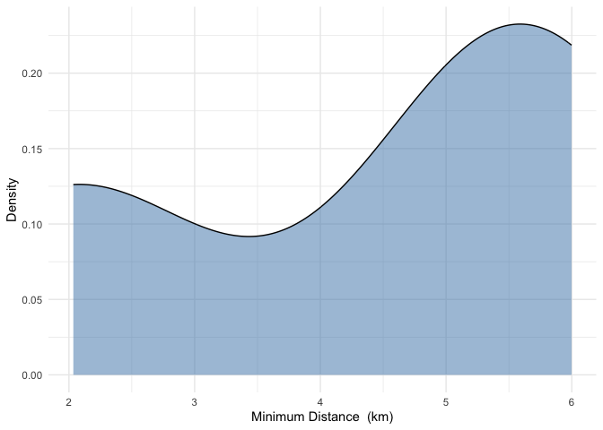
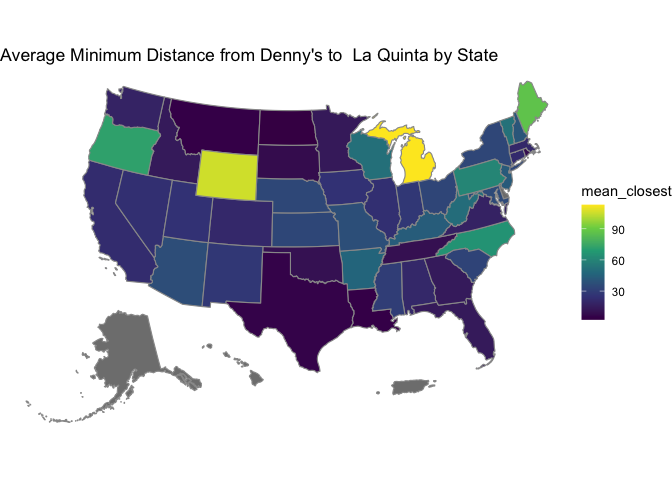

Lab 05 - La Quinta is Spanish for next to Denny’s, Pt. 2
================
Holland Sun
2026-Feb

### Load packages and data

``` r
library(tidyverse) 
```

    ## Warning: package 'readr' was built under R version 4.4.3

``` r
library(dsbox) 
```

``` r
states <- read_csv("data/states.csv")
```

### Exercise 1

``` r
dn_ak <- dennys %>%
  filter(state == "AK")

lq_ak <- laquinta %>%
  filter(state == "AK")
```

There is `3` Denny’s in Alaska

There is `2` La Quinta in Alaska

### Exercise 2

So there is `6` parings Between these locations.

### Exercise 3

``` r
dn_lq_ak <- full_join(dn_ak, lq_ak,
  by = "state"
)
```

### Exercise 4

There is `6` obserrvations in the `dn_lq_ak` data frram.

The names of the variables are
`address.x, city.x, state, zip.x, longitude.x, latitude.x, address.y, city.y, zip.y, longitude.y, latitude.y`

### Exercise 5

I think is `mutate` function that can add a new variable to a data fram
while keeping the existing varriables in tidyverse.

### Exercise 6

``` r
source("haversine.R")
dn_lq_ak <- dn_lq_ak %>%
  mutate(distance = haversine(longitude.x, latitude.x,
                              longitude.y, latitude.y, round = 3))
```

### Exercise 7

``` r
dn_lq_ak <- dn_lq_ak %>%
  group_by(address.x) %>%
  mutate(min_distance = min(distance)) %>%
  ungroup()
```

### Exercise 8

``` r
dn_distance_MIN <- dn_lq_ak %>%
  group_by(address.x) %>% 
  summarise(min_distance = min(distance))

ggplot(dn_distance_MIN, aes(x = min_distance)) +
  geom_density(fill = "steelblue", alpha = 0.5) +
  labs(x = "Minimum Distance  (km)",
       y = "Density") +
  theme_minimal()
```

<!-- -->

``` r
summary(dn_distance_MIN$min_distance)
```

    ##    Min. 1st Qu.  Median    Mean 3rd Qu.    Max. 
    ##   2.035   3.616   5.197   4.410   5.598   5.998

<span style="color: deepskyblue;"> *(I thought maybe boxplot also can be
a good idea, but density looks much better, except the later one may
provides some “overfiting/misleading” trend since we just have 3 data
point)* </span>

### Exercise 9,10,11

Since we are performing some kind of repetitive analysis, why not create
a function? and We could even analyze all states at once

``` r
PLmin_dis_cal <- function(state_index) {
  dn_state <- dennys %>% filter(state == state_index)
  lq_state <- laquinta %>% filter(state == state_index)
  
  dn_lq <- full_join(dn_state, lq_state, by = "state")
  
  dn_lq <- dn_lq %>%
    mutate(distance = haversine(longitude.x, latitude.x,
                                longitude.y, latitude.y, round = 3))
  
  mindist <- dn_lq %>%
    group_by(address.x) %>%
    summarise(min_distance = min(distance))
  
  return(mindist)
}
```

#### For NC

``` r
nc_mindist <- PLmin_dis_cal("NC")

ggplot(nc_mindist, aes(x = min_distance)) +
  geom_density(fill = "steelblue", alpha = 0.5) +
  labs(x = "Minimum Distance (km)", y = "Density",
       title = "NC") +
  theme_minimal()
```

<!-- -->

``` r
summary(nc_mindist$min_distance)
```

    ##    Min. 1st Qu.  Median    Mean 3rd Qu.    Max. 
    ##   1.779  22.388  53.456  65.444  93.985 187.935

#### For TX

``` r
tx_mindist <- PLmin_dis_cal("TX")

ggplot(tx_mindist, aes(x = min_distance)) +
  geom_density(fill = "steelblue", alpha = 0.5) +
  labs(x = "Minimum Distance (km)", y = "Density",
       title = "TX") +
  theme_minimal()
```

<!-- -->

``` r
summary(tx_mindist$min_distance)
```

    ##    Min. 1st Qu.  Median    Mean 3rd Qu.    Max. 
    ##  0.0160  0.7305  3.3715  5.7918  6.6303 60.5820

#### For NY

<span style="color: deepskyblue;"> Because my favorite comic I used to
read in high school geography class was Spider-Man, I chose New York lol
</span>

``` r
ny_mindist <- PLmin_dis_cal("NY")

ggplot(ny_mindist, aes(x = min_distance)) +
  geom_density(fill = "steelblue", alpha = 0.5) +
  labs(x = "Minimum Distance (km)", y = "Density",
       title = "NY") +
  theme_minimal()
```

<!-- -->

``` r
summary(ny_mindist$min_distance)
```

    ##    Min. 1st Qu.  Median    Mean 3rd Qu.    Max. 
    ##   1.281   7.381  24.158  33.575  53.265  99.044

### Exercise 12

Among the states examined, Mitch Hedberg’s joke is most likely to hold
true in Texas.

<span style="color: deepskyblue;"> Although I didn’t realized this
advantage when I initially chose the density plot, I’d like to
shamelessly point out this kind of intuitive visualization of
distributions makes it easier for us to draw conclusions at a glance is
some question like here. Moreover, we are essentially measuring the
entire population here which makes the density plot an even more
faithful representation. </span>

The distribution of minimum distances in TX is heavily right-skewed with
a median of only 3.37 km and a mean of 5.79 km. In contrast, NC ( median
= 53.46 mean= 65.44) and NY (median = 24.16 mean=33.58) show much larger
distances. Although Alaska has a small mean distance (4.41 km), the
sample size of only 3 Denny’s locations makes this unreliable.

### Exercise 14

<span style="color: deepskyblue;"> Ok, here’s another Holland’s comments
transcending time: </span>

<span style="color: deepskyblue;">*As I mentioned in my email this week,
I initially tried to complete a different lab. In that earlier lab (I
can’t remember if it was Lab 05, 06, or 07 I can never remember these
numbers) . I vaguely recall there was a question about an ugly or sad
plot where you could propose improvements, even if you couldn’t actually
implement them by code. In that exercise, I mentioned wanting to create
a heatmap. Seeing your ridgeline plot here inspired me: I could build a
heatmap on top of this, though it would sacrifice some information (the
shape of the distribution). The idea is to use the mean distance as a
representative value and assign different colors to different
states.*</span>

``` r
# Source pattern: https://stackoverflow.com/a/36149654
# Posted by inscaven
# Retrieved 2026-02-08, License - CC BY-SA 3.0

library(usmap) #import the package
library(tidyverse)
library(usmap)
library(ggplot2)
library(sf)
```

    ## Warning: package 'sf' was built under R version 4.4.3

    ## Linking to GEOS 3.13.0, GDAL 3.8.5, PROJ 9.5.1; sf_use_s2() is TRUE

``` r
library(grid)

# 1) Closest La Quinta distance for each Denny's (all states)
dn_lq_full <- full_join(
  dennys, laquinta,
  by = "state",
  suffix = c(".d", ".l")
) %>%
  filter(!is.na(latitude.d) & !is.na(latitude.l)) %>%
   filter(!state %in% c("AK", "HI")) 
```

    ## Warning in full_join(dennys, laquinta, by = "state", suffix = c(".d", ".l")): Detected an unexpected many-to-many relationship between `x` and `y`.
    ## ℹ Row 1 of `x` matches multiple rows in `y`.
    ## ℹ Row 23 of `y` matches multiple rows in `x`.
    ## ℹ If a many-to-many relationship is expected, set `relationship =
    ##   "many-to-many"` to silence this warning.

``` r
dn_lq_full_mindist <- dn_lq_full %>%
  group_by(address.d) %>%
  mutate(distance = haversine(longitude.d, latitude.d, longitude.l, latitude.l)) %>%
  summarize(
    closest = min(distance, na.rm = TRUE),
    state   = first(state),
    .groups = "drop"
  )

# make some adjustment
state_mean <- dn_lq_full_mindist %>%
  group_by(state) %>%
  summarise(mean_closest = mean(closest, na.rm = TRUE))
states_sf <- usmap::us_map(regions = "states")
states_sf <- states_sf %>%
  left_join(state_mean, by = c("abbr" = "state"))

ggplot(states_sf) +
  geom_sf(aes(fill = mean_closest), color = "gray60", linewidth = 0.4) +
  scale_fill_viridis_c(
    name = "Mean Min_Distance (km)",
    option = "plasma",
    direction = -1,    
    na.value = "gray90"
  ) +
  theme_void() +
  scale_fill_viridis_c(option = "viridis")+
  labs(title = "Average Minimum Distance from Denny's to  La Quinta by State")
```

    ## Scale for fill is already present.
    ## Adding another scale for fill, which will replace the existing scale.

<!-- -->

See you next lab :)
